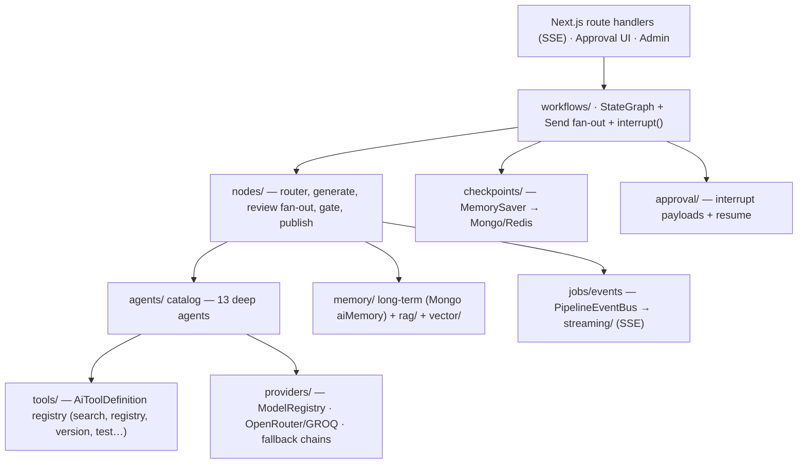
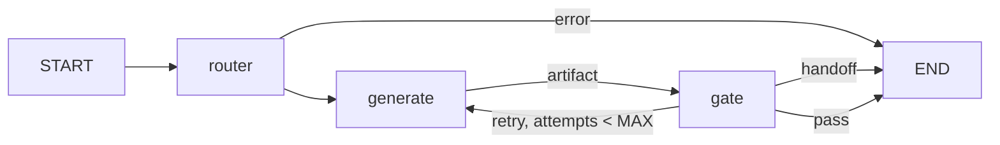
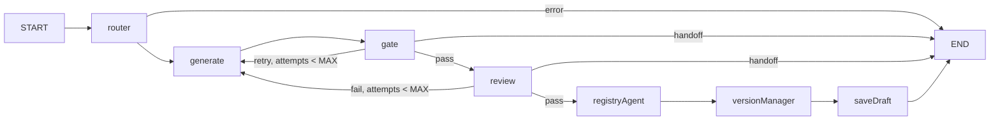
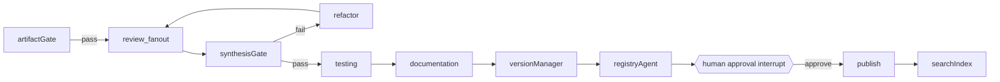
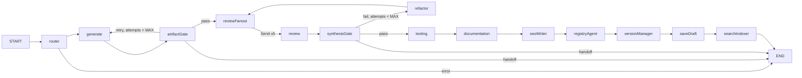
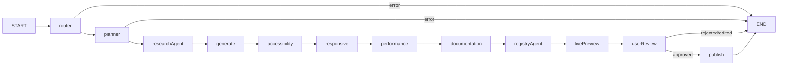
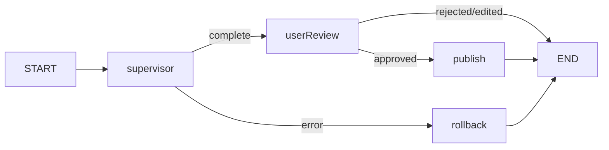

# Registry Multi-Agent System — Architecture

A LangGraph + DeepAgents orchestration layer for the Component Registry Platform.
All 15 agents collaborate through typed graph workflows. This is the reference
design; implementation proceeds in phases (see "Phased build").

## Scope & constraints

- Lives entirely under `features/ai/server/` (workflows, state, nodes, agents,
  approval, checkpoints, jobs, tools). The public barrel `features/ai/` never
  exports internals.
- Models are resolved ONLY through the `ModelRegistry` — no direct instantiation.
- Tools are `AiToolDefinition` (zod schema + handler) / `McpToolSpec` — never SDK types.
- Services are constructor-configured (deps injected); secrets read from
  `lib/env.ts` at request time.
- Every agent call records usage analytics; streaming is SSE server-generated.
- Files: one concern per file, hard ceiling 200 lines.

## System architecture

## Agent catalog

| Agent | Tier | Role |
|---|---|---|
| planner | cheap | Decompose a user prompt into a concrete build plan |
| research | cheap | Search the registry for similar components and conventions |
| componentGenerator | high | Produce component source + registry metadata from a request |
| componentReviewer | mid | Code correctness, style, API shape |
| uiUxReviewer | mid | Visual quality, design-token consistency |
| accessibility | mid | WCAG audit (axe + LLM review) |
| performance | mid | Bundle + render cost analysis |
| responsive | mid | Breakpoint behavior validation |
| documentation | cheap | README, props table, usage docs |
| registry | mid | Metadata, categorization, schema validation, publish |
| versionManager | cheap | semver bump, changelog, tags |
| search | cheap | Keyword + vector indexing/retrieval |
| refactor | high | Fix feedback, apply diffs |
| testing | mid | Generate + run tests (sandboxed) |
| seo | cheap | Meta tags, JSON-LD, sitemap |

Tier → model routing is configuration-driven (`TIER_MODELS`/`TIER_FALLBACKS` in
`agents/catalog.ts`), each tier with a fallback chain via `server/providers`.

## Workflow — component generation pipeline

Phase 1 wires the deterministic pipeline above plus the first quality gate and
the draft-save tail:

Later phases insert, in order:

Phase 2 implements the fan-out block up to `testing`; Phase 3 adds the
documentation, SEO, and search-indexing tail:

- Review fan-out uses LangGraph `Send` (parallel, map-reduce join into `reviews`).
- `synthesisGate` aggregates verdicts; failures route to the `refactor` agent
  (bounded by `MAX_GENERATION_ATTEMPTS`), then human handoff.
- Retries: node `RetryPolicy` (transient) + provider fallback + bounded refine loop.

## Workflow — component build (linear, human-gated publish)

`workflows/build.ts` (`buildBuildWorkflow`) implements a strictly linear flow,
one responsibility per agent, ending in a live preview and a human review
interrupt before publish:

- **planner** decomposes the prompt into a `BuildPlan`; **researchAgent** finds
  similar components and conventions (`search_components`); **generate** consumes
  both. Auditors (`accessibility`, `responsive`, `performance`) each append a
  `ReviewReport`; `documentation` and `registryAgent` produce docs + metadata.
- **livePreview** assembles the preview payload (slug + canonical URL) and
  emits a `preview_ready` event.
- **userReview** is a human-in-the-loop `interrupt()` carrying the artifact,
  preview, audits, docs, and metadata. `runBuildWorkflow` returns the interrupt
  payload to the client for live rendering; `resumeBuildWorkflow` resumes with a
  `Command({ resume })` decision. Only `approved` proceeds to **publish**
  (`createComponent`, `publishStatus: "published"`); `rejected`/`edited` end the
  run with the decision recorded in `state.review`.

## Human approval

Two `interrupt()` points, resumable per `threadId`:
1. **publish** — the build workflow's `userReview` node interrupts with the
   live preview; resuming `approved` publishes. `reject`/`edit` end the run.
2. **refactor_apply** — destructive diffs require approval.

Decisions: `approve | reject | edit` (with feedback); feedback re-enters at
`refactor`. The `ApprovalService` + store live in `approval/`.

## Memory & checkpoints

- **Working**: `GenerateState` (LangGraph `Annotation.Root`) — request, artifact,
  gate, error, attempts. The build workflow adds `state/build.ts` (`BuildState`):
  plan, research, reviews, docs, preview, review, published.
- **Checkpointed**: checkpointer factory (MemorySaver now, Mongo/Redis in Phase 4)
  → exact resume after retry/interrupt/crash for a `threadId`.
- **Long-term** (Phase 5): Mongo `aiMemory` + vector/rag context injection.

## Jobs & events

Long pipelines run as background jobs. `PipelineEventBus` emits node-level
events (`start`, `node_end`, `gate`, `approval_needed`, `error`, `done`) which
route handlers stream over SSE; clients never call providers.

## Workflow — autonomous component build (DeepAgent supervisor)

`workflows/autonomous.ts` (`buildAutonomousWorkflow`) runs a single
supervisor DeepAgent with all 10 capability tools. The agent
autonomously drives the full lifecycle: understand intent → plan
subtasks → generate → fix errors → audit accessibility → optimize
Tailwind → generate docs → request approval → publish. On any error
the graph routes to a `rollback` node that soft-deletes any published
component.

### Capability tools (`tools/capabilities/`)

Ten reusable `AiToolDefinition`s, each a self-contained unit:

| Tool | Type | Purpose |
|---|---|---|
| `understand_intent` | model | Parse a user prompt into a structured `BuildPlan` |
| `plan_subtasks` | model | Decompose a goal into ordered subtasks with status tracking |
| `generate_component` | model | Produce a `ComponentArtifact` from a request |
| `fix_errors` | model | Apply review feedback to source; return corrected artifact |
| `audit_accessibility` | model | WCAG 2.1 audit; returns a `ReviewReport` |
| `optimize_tailwind` | model | Optimize Tailwind classes; returns updated artifact |
| `generate_docs` | model | Write README, props table, usage docs |
| `publish_component` | action | Persist component to registry (`publishStatus: "published"`); requires an approved `approvalId` |
| `rollback_component` | action | Soft-delete a component (undo publish) |
| `request_approval` | action | Create an `ApprovalRequest` for a destructive stage |

The model-backed tools run their sub-agent with a narrow tool registry
(`search_components` only) to avoid recursion. The action tools call
registry service functions directly. The `publish_component` tool
enforces the approval gate: if no approved `ApprovalRequest` exists
for the thread+stage it returns an error, satisfying "request
approval before destructive actions."

### Approval flow

`request_approval` creates a pending `ApprovalRequest` via
`ApprovalService`. A human approves via `ApprovalService.decide`.
`publish_component` checks `approvalService.get(approvalId).status ===
"approved"` before persisting. The autonomous supervisor graph pauses
at `userReview` (reuses `makeUserReviewNode`/`interrupt()`) for the
human decision; on `approved` the `publish` node calls `createComponent`
with `publishStatus: "published"`.

## Phased build

1. **Phase 0 (done)** — docs, state, agent catalog, prompts, registry
   search tool, nodes (router/generate/gate), generate graph,
   checkpointer, approval service, event bus, pipeline runner, barrels.
2. **Phase 1 (done)** — shared `runAgent`/output helpers, Component
   Reviewer, Registry Agent, Version Manager, and the draft-save tail;
   review-fail retry loop with feedback.
3. **Phase 2 (done)** — parallel review fan-out (`Send`), review-synthesis
   join, Refactor Agent refine loop (bounded by `MAX_GENERATION_ATTEMPTS`),
   Testing Agent (test *generation*; sandboxed execution in Phase 4).
4. **Phase 3 (done)** — Documentation, SEO, and Search-indexing nodes
   (docs/seo/searchIndex artifacts; docs/SEO best-effort, search index runs
   after draft save).
5. **Build workflow (done)** — planner + research agents (catalog grows to
   15), linear `buildBuildWorkflow` with live preview, human review
   `interrupt()`, and approval-gated publish; `runBuildWorkflow`/
   `resumeBuildWorkflow` runners.
6. **Capability tools (done)** — 10 reusable `AiToolDefinition`s
   (`understand_intent`, `plan_subtasks`, `generate_component`,
   `fix_errors`, `audit_accessibility`, `optimize_tailwind`,
   `generate_docs`, `publish_component`, `rollback_component`,
   `request_approval`).
7. **Autonomous workflow (done)** — supervisor DeepAgent with capability
   tools, bounded step budget (`recursionLimit`), rollback on error,
   and human-gated publish via `interrupt()`/`Command`. `runAutonomousWorkflow`/
   `resumeAutonomousWorkflow` runners.
8. **Phase 4** — Mongo checkpointing, SSE route handlers, job queue, approval UI.
9. **Phase 5** — supervisor workflow refinement, RAG/vector memory, cache + routing tuning.
