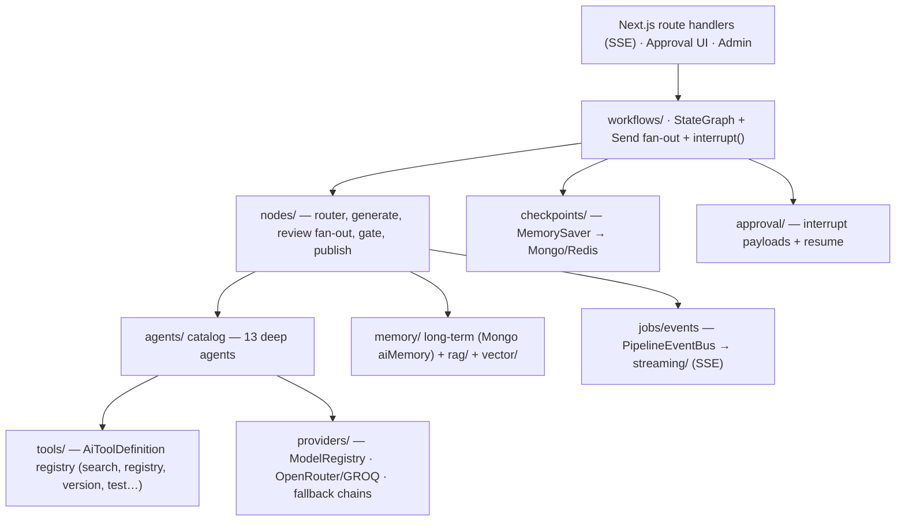
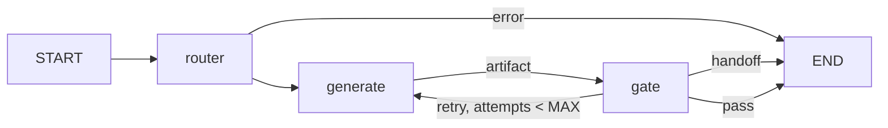
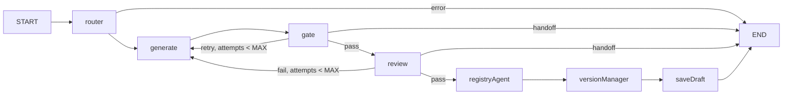
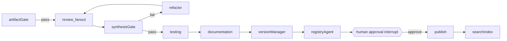
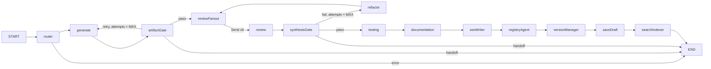

# Registry Multi-Agent System — Architecture

A LangGraph + DeepAgents orchestration layer for the Component Registry Platform.
All 13 agents collaborate through typed graph workflows. This is the reference
design; implementation proceeds in phases (see "Phased build").

## Scope & constraints

- Lives entirely under `features/ai/server/` (workflows, state, nodes, agents,
  approval, checkpoints, jobs, tools). The public barrel `features/ai/` never
  exports internals.
- Models are resolved ONLY through the `ModelRegistry` — no direct instantiation.
- Tools are `AiToolDefinition` (zod schema + handler) / `McpToolSpec` — never SDK types.
- Services are constructor-configured (deps injected); secrets read from
  `lib/env.ts` at request time.
- Every agent call records usage analytics; streaming is SSE server-generated.
- Files: one concern per file, hard ceiling 200 lines.

## System architecture

## Agent catalog

| Agent | Tier | Role |
|---|---|---|
| componentGenerator | high | Produce component source + registry metadata from a request |
| componentReviewer | mid | Code correctness, style, API shape |
| uiUxReviewer | mid | Visual quality, design-token consistency |
| accessibility | mid | WCAG audit (axe + LLM review) |
| performance | mid | Bundle + render cost analysis |
| responsive | mid | Breakpoint behavior validation |
| documentation | cheap | README, props table, usage docs |
| registry | mid | Metadata, categorization, schema validation, publish |
| versionManager | cheap | semver bump, changelog, tags |
| search | cheap | Keyword + vector indexing/retrieval |
| refactor | high | Fix feedback, apply diffs |
| testing | mid | Generate + run tests (sandboxed) |
| seo | cheap | Meta tags, JSON-LD, sitemap |

Tier → model routing is configuration-driven (`TIER_MODELS`/`TIER_FALLBACKS` in
`agents/catalog.ts`), each tier with a fallback chain via `server/providers`.

## Workflow — component generation pipeline

Phase 1 wires the deterministic pipeline above plus the first quality gate and
the draft-save tail:

Later phases insert, in order:

Phase 2 implements the fan-out block up to `testing`; Phase 3 adds the
documentation, SEO, and search-indexing tail:

- Review fan-out uses LangGraph `Send` (parallel, map-reduce join into `reviews`).
- `synthesisGate` aggregates verdicts; failures route to the `refactor` agent
  (bounded by `MAX_GENERATION_ATTEMPTS`), then human handoff.
- Retries: node `RetryPolicy` (transient) + provider fallback + bounded refine loop.

## Human approval

Two `interrupt()` points, resumable per `threadId`:
1. **publish** — `draft` auto-saves; `published` requires approval.
2. **refactor_apply** — destructive diffs require approval.

Decisions: `approve | reject | edit` (with feedback); feedback re-enters at
`refactor`. Approval service + store live in `approval/`.

## Memory & checkpoints

- **Working**: `GenerateState` (LangGraph `Annotation.Root`) — request, artifact,
  gate, error, attempts.
- **Checkpointed**: checkpointer factory (MemorySaver now, Mongo/Redis in Phase 4)
  → exact resume after retry/interrupt/crash for a `threadId`.
- **Long-term** (Phase 5): Mongo `aiMemory` + vector/rag context injection.

## Jobs & events

Long pipelines run as background jobs. `PipelineEventBus` emits node-level
events (`start`, `node_end`, `gate`, `approval_needed`, `error`, `done`) which
route handlers stream over SSE; clients never call providers.

## Phased build

1. **Phase 0 (done)** — docs, state, agent catalog, prompts, registry search
   tool, nodes (router/generate/gate), generate graph, checkpointer, approval
   service, event bus, pipeline runner, barrels.
2. **Phase 1 (this)** — shared `runAgent`/output helpers, Component Reviewer,
   Registry Agent, Version Manager, and the draft-save tail; review-fail retry
   loop with feedback.
3. **Phase 2 (done)** — parallel review fan-out (`Send`), review-synthesis
   join, Refactor Agent refine loop (bounded by `MAX_GENERATION_ATTEMPTS`),
   Testing Agent (test *generation*; sandboxed execution in Phase 4).
4. **Phase 3 (done)** — Documentation, SEO, and Search-indexing nodes
   (docs/seo/searchIndex artifacts; docs/SEO best-effort, search index runs
   after draft save).
5. **Phase 4** — Mongo checkpointing, `interrupt()` approvals, job queue + SSE, approval UI.
6. **Phase 5** — supervisor workflow, refactor workflow, RAG/vector memory, cache + routing tuning.
